# Resultados dos Testes

## 1. Criação do cofre

A API criou o cofre com sucesso e retornou seu identificador.

### Teste pela API

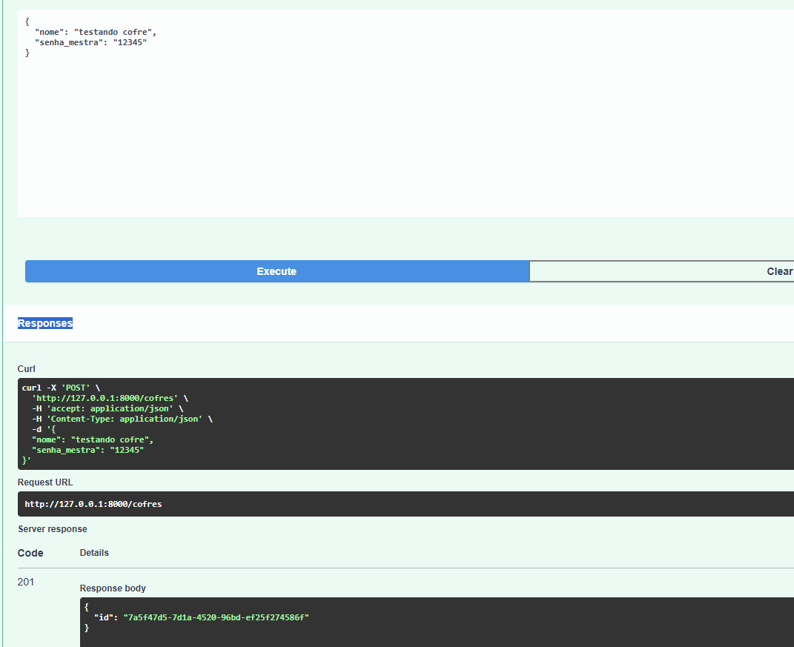

### Registro no Supabase

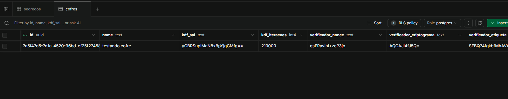

## 2. Abertura do cofre

A API verificou a senha mestra corretamente e permitiu a abertura do cofre.

### Teste pela API

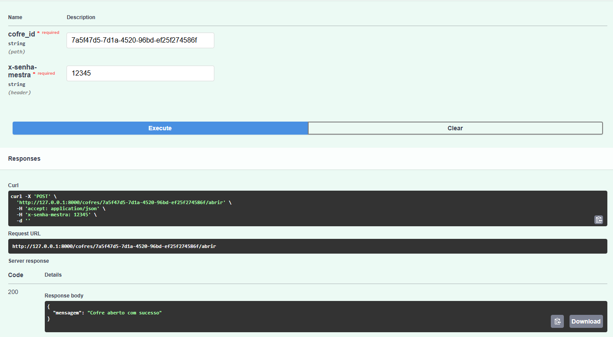

## 3. Criação de segredo

A API criou o segredo com sucesso e retornou seu identificador.

### Teste pela API

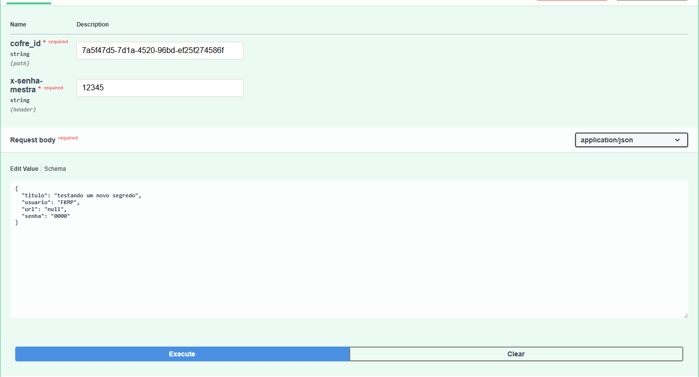

### Registro no Supabase

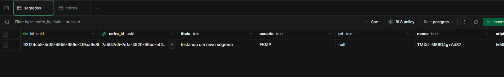

## 4. Listagem de segredos

A API verificou a senha mestra e listou corretamente os segredos armazenados no cofre.

### Teste pela API

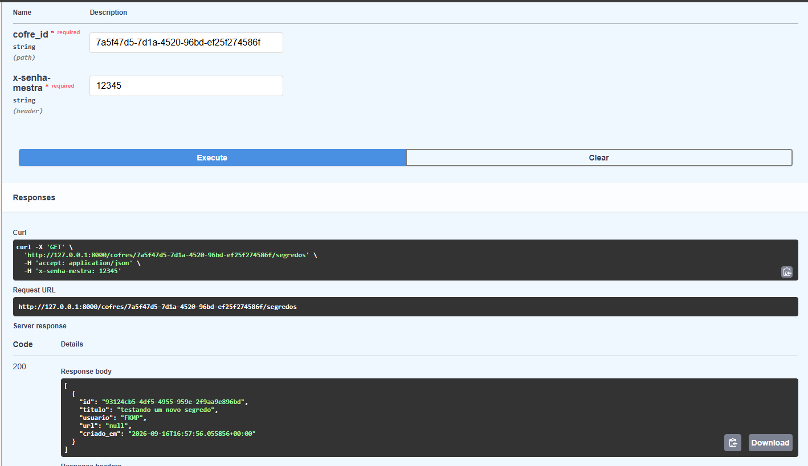

## 5. Busca e descriptografia

A API recuperou o segredo específico e descriptografou sua senha corretamente.

### Teste pela API

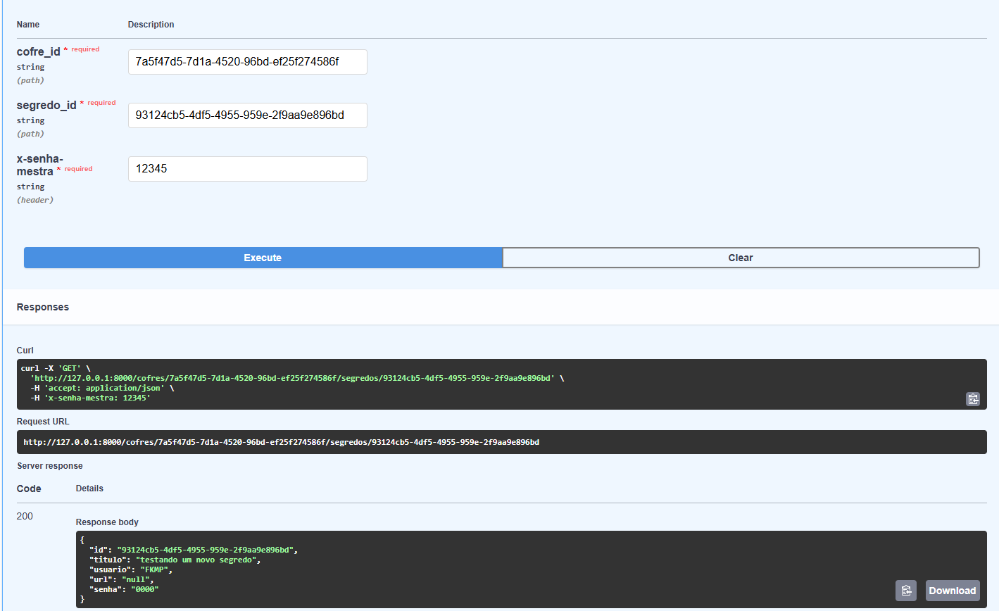

## 6. Atualização de segredo

A API atualizou corretamente os dados do segredo e gerou uma nova senha criptografada.

### Teste pela API

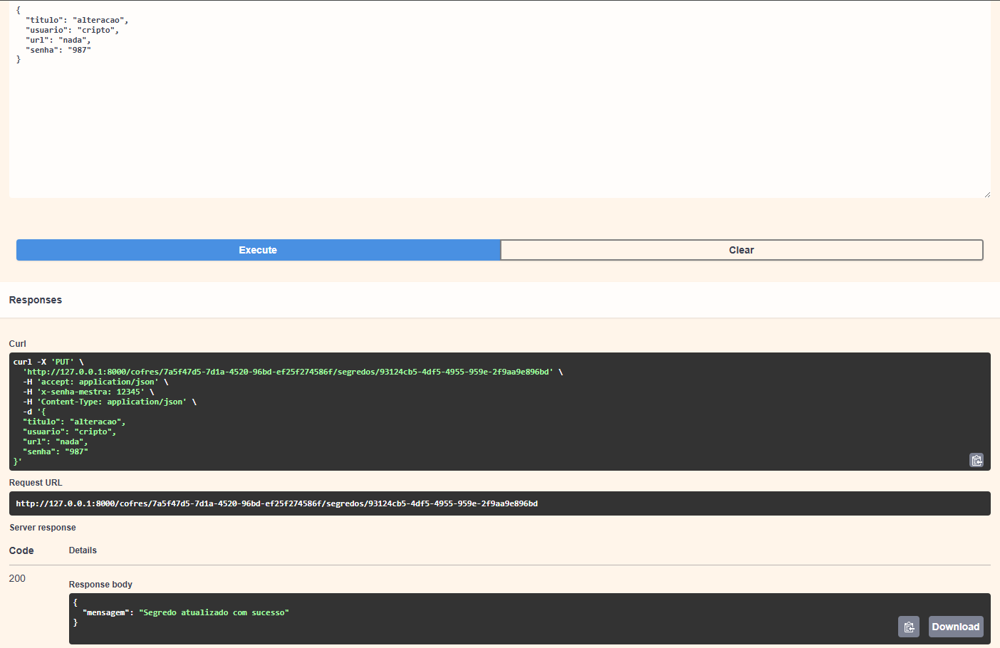

### Registro no Supabase

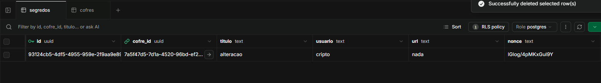

## 7. Exclusão de segredo

A API removeu o segredo com sucesso do cofre.

### Teste pela API

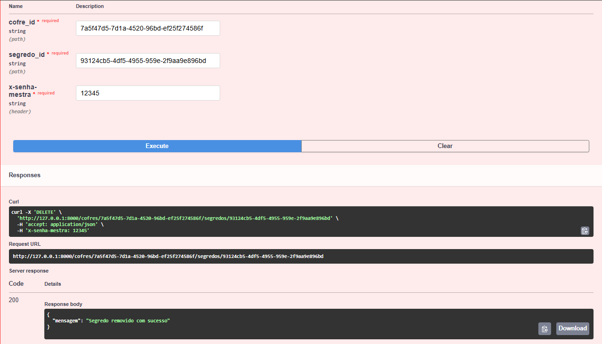

### Registro no Supabase

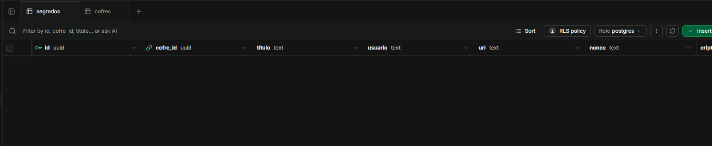

## 8. Validação de senha incorreta

A API recusou o acesso ao cofre quando foi fornecida uma senha mestra incorreta.

### Teste pela API

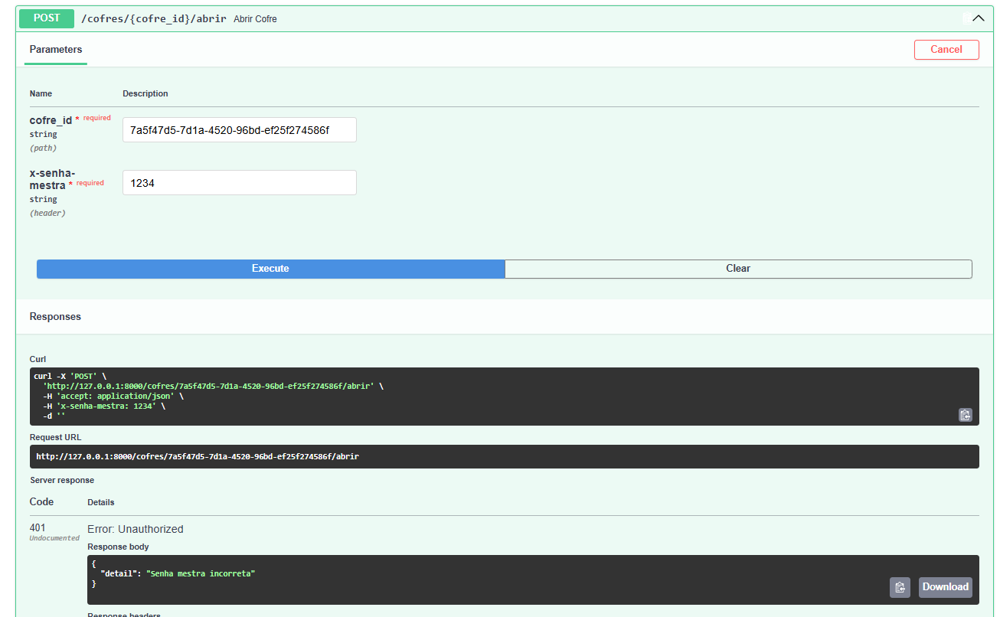